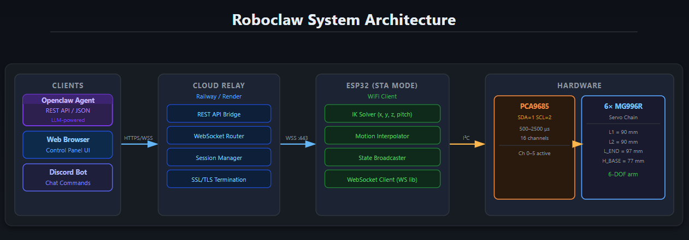

# RoboClaw

> **Spatial AI for industrial applications — from hardware to software.**

We are building the bridge between the physical world and intelligent software. RoboClaw is the robotic arm at the center of **OpenClaw**, a platform that gives AI agents a body: eyes, ears, and hands that can act in the real world without hardcoded instructions.

---

## Why RoboClaw?

Industrial sensors today are good at one thing — running fixed, predictable routines. That works, until the world changes. We believe the next generation of automation should be able to *adapt*.

RoboClaw is our answer to that problem. Starting from a redesigned **6-DOF robotic arm** on an ESP32, we are exploring what it looks like when a robot arm stops being a dumb executor and becomes a runtime-capable agent:

- **Go beyond static data service** — the arm responds dynamically to real-world inputs, not just pre-programmed paths
- **Runtime IO** — open the door to perception-action loops that don't require a firmware flash every time something changes
- **Multi-sensory action** — voice, vision, and external triggers can all drive behavior without hardcoding logic into the device
- **Scheduled real-world workflows** — cron-style jobs that do physical things, not just send notifications

The goal is a system where an LLM can plan a task, generate a path, schedule it, and execute it through the arm — all without a human in the loop.

---

## OpenClaw Architecture

RoboClaw is the **body** of OpenClaw. The full stack looks like this:

**OpenClaw Brain** (cloud + AI layer)
- Vision system and speech-to-text (SST)
- LLM message routing and intent parsing
- Path generation and skill composition
- Cron-based scheduling for recurring physical workflows

**RoboClaw Body** (this repo — ESP32 + servos)
- 6-DOF arm with onboard inverse kinematics
- WebSocket bridge to the cloud relay
- Voice/audio input via spare GPIO pins
- Real-time state broadcast to connected clients

---

## System Architecture



### Data flow

1. **Command in** — REST API call, browser UI click, Discord message, or sequence step
2. **Relay** — `server.js` validates auth and forwards JSON over WebSocket to ESP32
3. **ESP32 executes** — IK solver converts (x,y,z,pitch) → servo angles, PCA9685 drives servos
4. **State back** — ESP32 streams `{type:"state", angles:[...]}` every ~50 ms while moving
5. **Broadcast** — server fans state out to all connected browser clients in real time

---

## Project Structure

```
Roboclaw/
├── backend/                  # Node.js cloud relay server
│   ├── server.js             # Express + WebSocket bridge (main entry point)
│   ├── package.json
│   ├── .gitignore
│   └── .env.example          # Environment variable template
│
├── frontend/                 # Browser control panel (served as static files)
│   └── index.html            # Single-page app — Control + Agent tabs
│
├── firmware/                 # ESP32 Arduino sketch
│   └── esp32_cloud_client/
│       └── esp32_cloud_client.ino
│
└── docs/
    └── IK_API.md             # REST API reference for AI agents
```

---

## Quick Start

### 1. Deploy the backend

```bash
cd backend
npm install
cp .env.example .env
# edit .env — set API_TOKEN to something secret
npm start
```

Deploy to Railway, Render, or Fly.io. Set the env vars from `.env.example` in your
platform dashboard. The server listens on `$PORT` (default 3000).

### 2. Flash the firmware

Open `firmware/esp32_cloud_client/esp32_cloud_client.ino` in Arduino IDE.

Edit the four config lines at the top:

```cpp
const char* WIFI_SSID  = "YourSSID";
const char* WIFI_PASS  = "YourPassword";
const char* SERVER_HOST = "your-app.up.railway.app";
const bool  SERVER_SSL  = true;
```

Install required libraries via Arduino Library Manager:
- **WebSockets** by Markus Sattler
- **ArduinoJson** by Benoit Blanchon
- **Adafruit PWM Servo Driver Library**

Flash to ESP32. Open Serial Monitor (115200 baud) to confirm connection.

### 3. Open the control panel

Navigate to your server URL in a browser. The **Control** tab shows:
- Live 2D workspace map (click to set target X/Z)
- XYZ position inputs + Move button
- Per-joint manual sliders

The **Agent** tab shows AI agent messages and the movement log.

---

## Hardware

| Component | Details |
|-----------|---------|
| Microcontroller | ESP32 (any variant) |
| Servo driver | PCA9685 — I2C address 0x40 |
| I2C pins | SDA = GPIO 1, SCL = GPIO 2 |
| Servos | 6× MG996R (channels 0–5) |
| PWM frequency | 50 Hz |
| Pulse range | 500–2500 µs |

### Arm geometry

```
L1     = 90 mm   shoulder → elbow
L2     = 90 mm   elbow → wrist
L_END  = 97 mm   wrist → gripper tip
H_BASE = 77 mm   ground → shoulder pivot
```

Practical reach: **X 60–220 mm · Z 30–220 mm · Y ±150 mm**

### Joint map

| Channel | Joint    | Range    |
|---------|----------|----------|
| 0       | Base     | 0–180°   |
| 1       | Shoulder | 0–180°   |
| 2       | Elbow    | 0–180°   |
| 3       | Wrist    | 2–178°   |
| 4       | Wrist2   | 2–178°   |
| 5       | Gripper  | 0–180°   |

---

## REST API

All write endpoints require `x-api-token: <your token>` header.

| Method | Endpoint | Description |
|--------|----------|-------------|
| POST | `/api/ik_move` | Move gripper to (x, y, z, pitch) — ESP32 solves IK |
| POST | `/api/gripper` | Set gripper angle (0=open, 180=closed) |
| POST | `/api/home` | All joints to 90° |
| POST | `/api/servo` | Direct servo override by channel |
| POST | `/api/sequence` | Run a timed move sequence |
| POST | `/api/sequence/stop` | Cancel running sequence |
| POST | `/api/message` | Push chat message to browser |
| GET  | `/api/state` | Current joint angles + ESP32 status (no auth) |

See `docs/IK_API.md` for full request/response details and the pick-and-place pattern.

---

## Environment Variables

| Variable | Default | Description |
|----------|---------|-------------|
| `PORT` | 3000 | HTTP listen port |
| `API_TOKEN` | changeme | Auth token for write endpoints |
| `DISCORD_TOKEN` | — | Discord bot token (optional) |
| `DISCORD_CHANNEL` | — | Discord channel ID to monitor (optional) |

---

## WebSocket Protocol

The ESP32 connects to `wss://your-server/ws/esp32`. Browsers connect to `/ws/browser`.

**Server → ESP32:**

| Message | Description |
|---------|-------------|
| `{"type":"ik_move","x":150,"y":0,"z":100,"pitch":0}` | Move to world coordinate |
| `{"type":"move","channel":5,"angle":90}` | Direct servo command |
| `{"type":"move_all","angles":[90,90,90,90,90,90]}` | Set all joints |
| `{"type":"get_state"}` | Request state report |

**ESP32 → Server → Browsers:**

| Message | Description |
|---------|-------------|
| `{"type":"state","angles":[...]}` | Current joint angles (broadcast every ~50 ms while moving) |
| `{"type":"error","message":"..."}` | IK solve failure |
